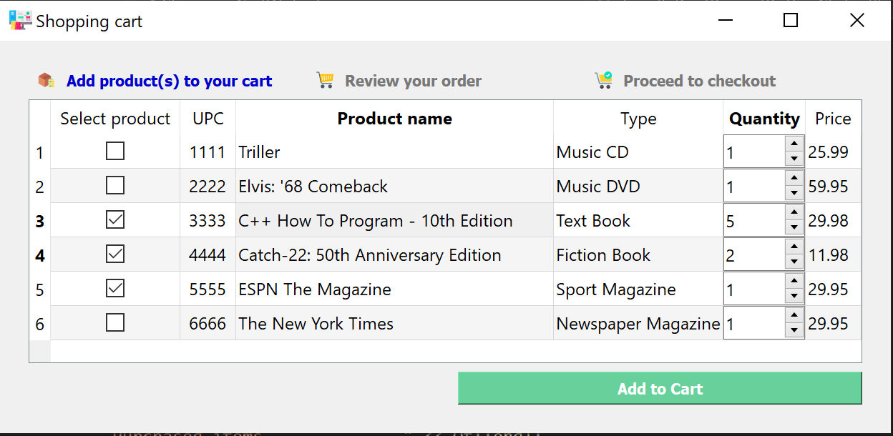
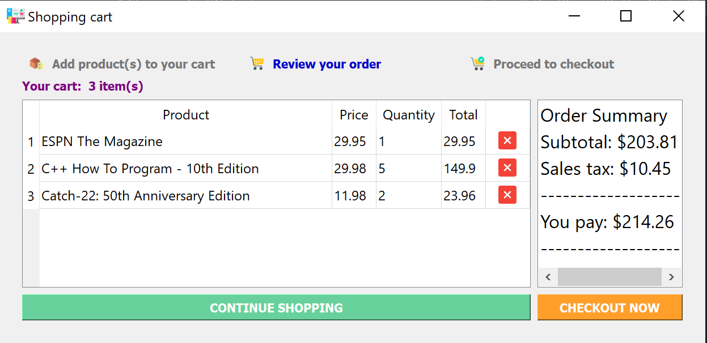
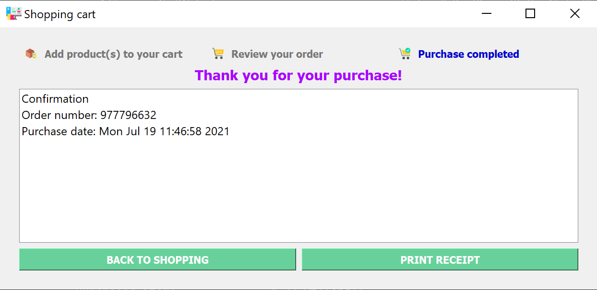

# CPPND: Capstone Shopping Cart Repo

This is a repo for the Capstone project in the [Udacity C++ Nanodegree Program](https://www.udacity.com/course/c-plus-plus-nanodegree--nd213).

For this project, I went with Capstone Option 1 and built my own application that simulates a shopping cart using C++ and Qt. 
* Development tools:
	* The program was written using Visual Studio 2019 with the CMake build system. 
	* Qt C++ is used to create a GUI for the shopping cart. 
* Design Description:
	* Functionality: 
		* The main functionality of the shopping cart program is to facilitate the purchase of a product item(s). It contains a collection of items limited to Music, CDs, Books, and Magazines. 
		A user can add a single or collection of product items to a shopping cart, review items that are ready for checkout, remove items from the cart (if not desired for purchase), 
		view order summary, check out an order, and generate receipt after completing a purchase. 

	* Design/Implementation Rationale: 
		* The program is written by applying an object-oriented (Composition/Inheritance/Polymorphism) concept. 
		* The design separates the program functionality into independent modules. For example, UI class serves to display product item information while model classes serve to store a collection of product Items. 
		* The program contains a total of nine classes – one main class, one UI class, and seven user-defined model classes.
		* The UI class and some of the model classes used smart pointers, move semantics, lambdas, algorithms, and enums. 
		* The program support writing the content of shopping cart items, order summary, and order confirmation into a single file. This file is considered a receipt.
		
	* Class functionalities:
		* Main: 
		  * Creates unique_ptr object that points to a databse object. Once the databse object is instantiated, the ownership of the pointer is transferred to the UI class ShoppingCartWidget. 
		* Database: 
		  * This class constructs objects for Music, Books, and Magazine product items. It is considered as database of record for product items.
		* ShoppingCart: 
		  * This class contains user selected product item(s).  It has functions to add or remove product tems, and update the quantity of a product item.
		* ProductItem: 
		  * This is a base and abstract class that contains data member and function for Music, Books, and Magazine product items. 
		* Music: 
		  * This is a derived class that inherits all of the properties from the base class and have its own data members and functions for a Music product items. 
		* Book: 
		  * This is a derived class that inherits all of the properties from the base class and have its own data members and functions for a Book product items. 
		* Magazine: 
		  * This is a derived class that inherits all of the properties from the base class and have its own data members and functions for a Magazine product items. 
		* Date:
		  * Contains data member day, month, and year. Other classes use the date class to construct day, month, and a year by composition. 
		* ShoppCartWidget 
		  * This is a UI layer class that contain both standard C++ and Qt code. The UI is composed of a stacked widget to display product items(`m_productsWidget`) , cart items(`m_cartWidget`), and has order completion screen(`m_doneWidget`). 
		  These widgets are displayed independently. The following functionalities are handeled by this class:
			* When the program launches, it display all the product items retrieved from the databse class to the GUI's widget (i.e. `m_productsWidget`). 
			The ShoppingCartWidget constructor iterate thru the databse product items and calls the `addProductItemsFromDatabse` function so it can be added to a table(i.e. `m_productsTableWidget`) and displayed on the GUI. 
			* When a user selects a single or multiple products from the GUI, the selected items will be added to the model ShoppingCart class. Inside the `addProductItemsFromDatabse` function, there is lambda that uses a Qt signal/slot mechanism 
			to capture when a check box state is changed and calls the ShopingCart `addItem` method to add the item. The same goes when removing an item from a shopping cart.  
			* Once product item(s) are selected and the `Add to cart` button is clicked, the data will be retrieved from the ShoppingCart class and displayed on the GUI's cart widget (i.e. `m_cartWidget`). 
			The ShoppingCart constructor has a Qt signal/slot connection for the Add to cart button (i.e. `m_addToCartButton`). When the button is clicked, the event is captured by the slot `handleAddToCartButtonClicked`. 
			Inside the slot, the cart items are retrieved from the model ShoppingCart class and displayed on the GUI. Also, the the shopping cart displays an order summary. It shows the user a sub total amount, sales tax, and total purchase amount. 
			This is accomplished by `orderSummary` method that is called from the `handleAddToCartButtonClicked`handler. If the user did not select anything and clicked `Add to Cart`button, a warning message will pop up with a message `At least one product item must be selected!`
			This is done using the Qt `QMessageBox` class. 
			* From the shopping cart screen, an item can be removed from the cart by clicking on the delete icon. Inside the `addItemToCart` function, there is lambda that uses a Qt signal/slot mechanism 
			to capture when the delete icon is pressed and calls the ShopingCart `removeItem` method to remove the item from the cart. The lambda also emit `itemRemovedFromCart` signal which gets captured by `handleItemReomvedFromCart` slot
			so that the same item from the products widgets gets un-selected (unchecked). Further more, inside the lambda, the `displayTotalCartItem` is called  to update the number of items displayed on the shopping cart. It also updates the order summary information 
			by calling into the `orderSummary` method. 
			* The Shopping cart sceen has a `CONTINUE SHOPPING` and `CHECKOUT NOW` button. Clicking the `CONTINUE SHOPPING` will take the user back to the product screen by switching the stacked widget from `m_cartWidget` to `m_productsWidget`. 
			Clicking the `CHECKOUT NOW` button first brings a warning message `By clicking Yes, you complete your purchase and agree to our Terms of Use.` clicking yes will take the user to the order completion screen by switching from `m_stackedWidget` to `m_doneWidet`. This logic is handled 
			by `handleCheckoutNowButtonClicked` slot. The signal/slot connection for this handler is done in the `ShoppingCartWidget` constructor. The handler has a logic to generate random numbers using `QRandomGenerator` class. This number is used as a confirmation number for the purchased items.
			It also has a logic to get the purchase date and time using the `time_t` object. 
			* From the order completion screen, if a user clicks on `BACK TO SHOPPING`, the product item screen will be displayed by switching the page from `m_doneWidet` to `m_productsWidget`. This is accomplished by `handleBackToShoppingButtonClicked` slot. This handler perform additional logic to 
			un-select/uncheck all product items from the product item screen (i.e. m_productsWidget). If a user clicks on `PRINT RECEIPT`, a file called `receipt.txt` will be generated in the build directory of the program. This file serve as an invoice to the purchased products for the user.   		

## Shopping Cart GUI
* Product widget 

* Cart widget 

* Order completion widget (done widget)

## Dependencies for Running Local function 
This program is built on windows platform using the below dependencies
* cmake 3.21
  * All OSes: [click here for installation instructions](https://cmake.org/install/)
* make 3.81 (Windows)
  * [Click here for installation instructions](http://gnuwin32.sourceforge.net/packages/make.htm)
* gcc/g++ >= 5.4
  * Windows: recommend using [MinGW](http://www.mingw.org/)
* Qt >= 5.15.2 
  * [Click here for installation instructions](https://www.qt.io/download)
  * [Click here for Qt installation tutorial](https://youtu.be/sEXOkBm_fuo)
  * Note: 
    * Include msvc2019_64 component as part of your Qt installation.
	* Make sure to add QT to System enviroment. Also add C:\Qt\5.15.2\msvc2019_64\bin to a path to avoid dll not found erros. Example: "The code execution can not proceed because qt5core.dll was not found". Adjust accordingly if your Qt installation is in a different directory. 
   
* Visual Stuidio 2019 Community version
  * [Click here for installation instructions](https://visualstudio.microsoft.com/vs/)
  
* Configure Visual Studio 2019 to use QT
  * [Click here for tutorial](https://youtu.be/6bXrfVrYyxk)

## Basic Build Instructions

* Workflow option 1:
1. Clone this repo.
2. Make a build directory in the top level directory: `mkdir build && cd build`
3. Using visual studio 2019, open the CMakeLists.txt located in the cloned repo. `File->open->CMake...` 
	* Note: this step will configure/generate cmake and creats a build directory `out`. If this is not done automatically, got to `Project->Generate Cache`
3. Run the executable. `Select Start item->ShoppingCart.exe` 

* Workflow option 2:

1. Make a build directory in the top level directory: `mkdir buil && cd build`
2. Open CMake (cmake-gui) and set the following options
	* "Where is the source code:" browse to the CppND-Capstone-ShoppingCart folder
	* "Where to build the binaries:" browse to build directory or your choice of where CMake will place the generated binary files
3. Click "Configure" button and confirm configuration is done
	* Select Visual Studio 2019 for the generator and click Finish
4. Click on "Generate" and confirm generating is done
5. Click on "Open Project"
	* This will open the project in Visual Studio
6. In Visual studio solution explorer window , make ShoppingCart as a start up project. `Right click on ShoppingCart->Set as Startup Project`
7. Run the program

## Rubric points 

* README (All Rubric Points REQUIRED)
	* A README with instructions are included with this project - Yes  					
	* The README indicates which project is chosen - Yes  																	
	* The README includes information about each rubric point addressed - Yes																

* Compiling and Testing (All Rubric Points REQUIRED)
 
	* The submission must compile and run - Yes 													
																	
* Loops, Functions, I/O
	* The project demonstrates an understanding of C++ functions and control structures.
 Here are a couple of example where control structures are used in the code:  
		* Database.h line 16 - the function productItems() returns a vector of product item pointers. Other classes who needs this information can call to this function. For example, ShoppingCartWidget.cpp line 59,60 calls to this function to retrieve the shopping cart items to display them on the GUI.  
		* ShoppingCartWidget.h line 38-44 - utility functions are used to support the operation of the shopping cart widget class. These functions are declared as private member since they dont needed by other classes.  
		* ShoppingCartWidget.cpp line 58 - a range-based for loop is used instead of a regular for loop since range-based for loops provides a read-only or read/write reference to objects in containers such as a vector.
 Also, product items are retrieved by const reference for performance reason.  
		* The program is implemented with object-oriented(Composition/Inheritance/Polymorphism) concept. As a result, the code can be scaled and be used in the future to add more product items. For example, a new product items class can be added that inherits the ProductItem class.
	* The project reads data from a file and process the data, or the program writes data to a file.
		* ShoppingCartWidget.cpp line 293-302. The logic inside the `handlePrintReceiptButtonClicked()` function writes data to a file. the file name is `receipt.txt`. 
	* The project accepts user input and processes the input.
		* All user input used in this program is handled using a Qt c++ code. For example, ShoppingCartWidget.cpp line 261 - this line of code accept user input when an OK button is clicked from the GUI and ShoppingCartWidget.cpp line (138-144) - adds item to a model class `shoppingCart` when user selects an item from the GUI. 
	
* Object Oriented Programming
	* The project uses Object Oriented Programming techniques:
		* The program is implemented with object-oriented(Composition/Inheritance/Polymorphism) concept. For example, classes such as `Book`, `Magazine`, and `Music` inherits from the base class `ProductItem`. Also, these classes access the `Date` class by composition. 
	* Classes use appropriate access specifiers for class members:
		* yes. Please refer to any of the class for this project. 
	* Class constructors utilize member initialization lists:
		* yes. ProductItem.cpp line (5-10) can be used as an example. 
	* Classes abstract implementation details from their interfaces:
		* Yes. The interface are included in the header file while implementation are in the .cpp file. 
	* Classes encapsulate behavior:
		* yes. For example, ShoppingCart.h line 17 and 20. member data `m_shoppingCartItems` can only be accessed by a member function `shoppingCartItems()`.
	* Classes follow an appropriate inheritance hierarchy:
		* Yes. As mentioned above classes such as `Book`, `Magazine`, and `Music` inherits from the base class `ProductItem`. This is logical because the realtionship between the abstract and derived classes satsfiy the `IS-A relasionship`. A book is a product item, music is a product item, and magazine is a product item.  
		Also the the ProductItem class is composed of a pure virtual function (ProuductItem.h line 16).
	* Overloaded functions allow the same function to operate on different parameters:
		* This is used as part of a Qt code (ShoppingCartWidget.cpp line 146) where the signal for QSpinBox is overloaded to an int type.  
	* Derived class functions override virtual base class functions:
		* No. 
	* Templates generalize functions in the project:
		* Template not used in this project

* Memory Management
	* The project makes use of references in function declarations:
		* Book.cpp (line 5-7), ProductItem.cpp (line 5-6). 
	
	* The project uses destructors appropriately:
		* Book.h line 17 - ProductItem.h line 16. 

	* The project uses scope / Resource Acquisition Is Initialization (RAII) where appropriate:
		* Main.cpp line 12. 
		
	* The project follows the Rule of 5:
		* Rule of five was not followed in this project
	
	* The project uses move semantics to move data, instead of copying it, where possible:
		* Main.cpp line 12 and 14 - main used unique_ptr to construct databse object and moved the ownership to the UI layer `ShoppingCartWidgt` using std::move 
		
	* The project uses smart pointers instead of raw pointers: 
		* main.cpp line 12 uses unique_ptr, Databse.cpp line 15 uses a vector of shared_ptr product items.

* Concurrency 
	* Concurrency is not used in this project. 